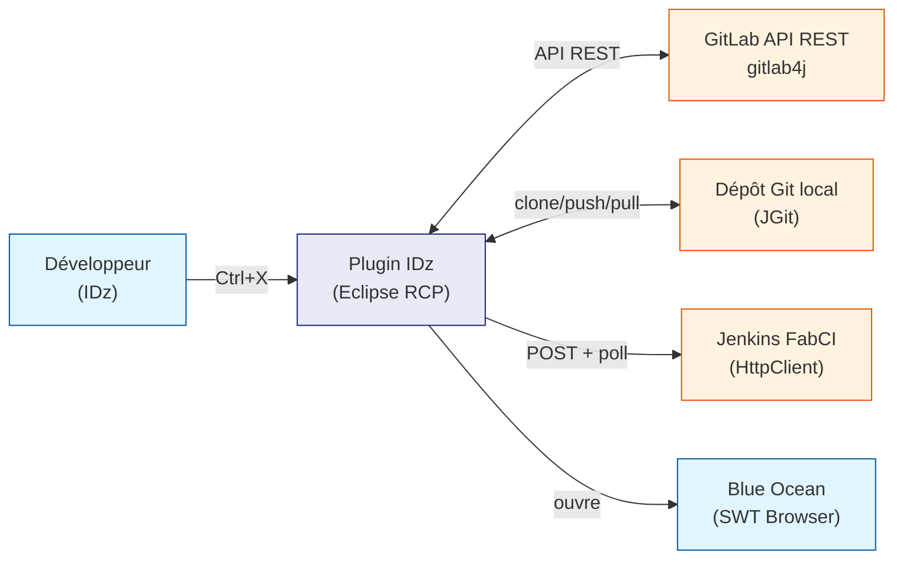
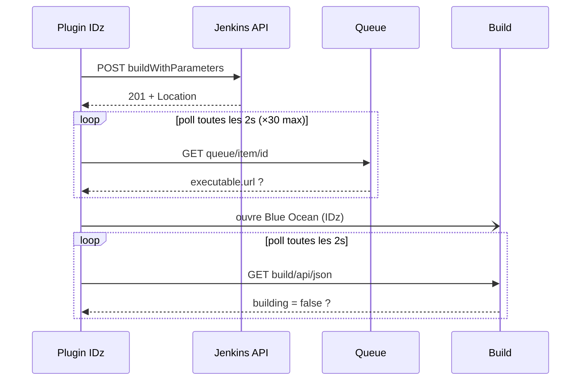

# Analyse de l'existant — Plugin Eclipse IDz zDevOps

> **Objectifs de ce document**
>
> 1. Fournir une analyse complète et objective du plugin Eclipse IDz zDevOps tel qu'il existe
>    au moment de la rédaction (version 2.0.1-SNAPSHOT).
> 2. Servir de base pour **corriger les bugs** et **risques identifiés** dans l'existant.
> 3. Alimenter les **ADR** (Architecture Decision Records) en vue d'une réécriture de la
>    logique métier sous forme d'API FastAPI.

---

## Périmètre analysé

Ce document couvre exclusivement le **plugin Eclipse IDz** — pas les pipelines Jenkins ni la
fabrique CI dans le détail. Les interactions avec Jenkins sont décrites au niveau des
contrats d'interface uniquement.

**Sources analysées :**

- Code source Java : `plugin/src/fr/lcl/zdevops/idz/plugin/`
- Documentation technique : `doc/` (14 business rules, architecture, interface, glossaire)
- Documentation critique : `doc/analyse/` (bugs, architecture, sécurité, processus)

---

## Architecture technique

### Stack technologique

| Couche | Technologie | Rôle |
| ------ | ----------- | ---- |
| **Plateforme** | Eclipse RCP / OSGi (IBM IDz 16+) | Conteneur du plugin |
| **Langage** | Java 17 | Implémentation |
| **Build** | Maven + Tycho 4.0.8 | Compilation + site P2 |
| **Git local** | JGit | Clone, commit, push, pull, checkout |
| **GitLab** | gitlab4j-api | API REST GitLab |
| **Jenkins** | HttpClient Java 11 natif | Déclenchement pipelines + polling |
| **UI** | SWT / JFace | Dialogs et vues Eclipse |
| **Sécurité** | Equinox Secure Storage | Chiffrement des tokens |
| **Logs** | SLF4J (partiel) | Logging — voir bug m5 |

### Structure des classes (~75 classes Java)

```
fr.lcl.zdevops.idz.plugin/
├── Activator.java                     Cycle de vie OSGi du plugin
├── config/
│   └── ConfigLoader.java              Lecture .properties par toolchain
├── exceptions/                        4 exceptions métier custom
├── services/
│   ├── IGitLabService.java            Interface principale
│   ├── IGitService.java               Interface Git alternative
│   ├── JenkinsJobService.java         Appels HTTP Jenkins + polling
│   └── impl/
│       └── GitLabService.java         ⚠️ God Object ~1800 lignes (voir A2)
├── ui/
│   ├── handlers/                      12 handlers Eclipse (DeployHandler gère Promote ET Clean)
│   ├── dialogs/                       8 boîtes de dialogue SWT
│   ├── models/                        9 classes de données (ManifestModel…)
│   ├── monitors/                      11 opérations longues (Eclipse Jobs)
│   └── views/
│       └── JenkinsBrowserView.java    Affichage Blue Ocean dans IDz
└── utils/                             6 utilitaires (config, logger, validation…)
```

### Flux de communication



---

## Inventaire des 14 fonctions

### Gestion des évolutions

| Raccourci | Fonction | Description synthétique |
| --------- | -------- | ----------------------- |
| `Ctrl+1` | Démarrer une évolution | Crée `feature_XXX` dans GitLab, clone le dépôt, initialise le manifest `.mf.json`, installe les hooks Git |
| `Ctrl+2` | Participer à une évolution | Rejoint une branche existante — clone ou mise à jour du dépôt local |
| `Ctrl+8` | Évolution depuis une évolution | Crée une sous-branche depuis une `feature_XXX` existante (travail parallèle) |
| `Ctrl+9` | Consulter les sources | Checkout lecture seule sur `master` — aucune modification possible |

### Gestion des composants et du manifest

| Raccourci | Fonction | Description synthétique |
| --------- | -------- | ----------------------- |
| `Ctrl+4` | Mettre à jour les copybooks | Télécharge les copybooks externes depuis GitLab dans `dex_read_only/` |
| `Ctrl+5` | Gérer les composants | Déclare les fichiers sources à compiler dans le manifest (sélection par checkbox) |
| `Ctrl+7` | Gérer les dépendances | Déclare les dépendances vers des copybooks en cours de développement dans d'autres branches |

### Compilation et déploiement

| Raccourci | Fonction | Pipeline Jenkins | Description synthétique |
| --------- | -------- | ---------------- | ----------------------- |
| `Ctrl+0` | Builder | `BuildAndPush` | Compile via DBB sur z/OS → artefact `.tar` dans Artifactory feed `scratch` |
| `Ctrl+B` | Déployer | `ProxyCD` | Orchestre le déploiement multi-sites via le service CD CAGIP |
| clic droit | Promote Unitaire | `PromoteUnitaire` | Copie un seul composant en environnement TU pour validation rapide |
| clic droit | Clean Unitaire | `CleanUnitaire` | Retire un composant de l'environnement TU |

### Qualité et administration

| Raccourci | Fonction | Pipeline Jenkins | Description synthétique |
| --------- | -------- | ---------------- | ----------------------- |
| `Ctrl+6` | Audit | `auditEtQualite` | Vérifie la conformité du code et valide la quality gate SonarQube |
| `Ctrl+E` | Token GitLab | — | Configure et stocke le token d'accès personnel GitLab (Equinox Secure Storage) |
| `Ctrl+K` | Token Jenkins | — | Configure le token Jenkins — stockage séparé par toolchain (dev/rec/frm/prd) |

---

## Interface plugin ↔ Jenkins — Séquence HTTP

Pour les fonctions qui déclenchent un pipeline Jenkins (Builder, Déployer, Audit,
Promote Unitaire, Clean Unitaire), le plugin suit une séquence HTTP en 3 phases :
déclenchement, attente de la file d'attente, suivi du build.

### sequenceDiagram



---

## Bugs avérés

Dix bugs ont été identifiés dans le code source (version 2.0.1-SNAPSHOT) — cinq critiques, cinq mineurs, auxquels s'ajoutent cinq bugs supplémentaires découverts lors de l'analyse approfondie du code.

### M1 — Race condition sur `applications.json` 🔴 Critique

**Fichier :** `GitLabService.java` — `writeBranchManifest()`, `updateApplication()`

Le numéro d'artefact (`next_artifact_number`) est incrémenté via un cycle Read → Modify →
Write **non atomique**. Si deux développeurs créent simultanément une évolution sur la même
application, les deux lisent le même compteur, incrémentent à la même valeur, et l'un
écrase silencieusement le commit de l'autre.

**Conséquence :** deux branches `feature_` avec un `manifest_name` identique →
corruption silencieuse d'`applications.json` et conflits dans Artifactory.

**Correction :** utiliser l'API GitLab avec `last_commit_id` (optimistic locking) pour
rejeter la mise à jour si le fichier a changé entre la lecture et l'écriture.

---

### M2 — `changeListener` jamais assigné au champ d'instance 🔴 Critique

**Fichier :** `Activator.java`

La variable `changeListener` dans `start()` est déclarée **locale** et non affectée au
champ d'instance `this.changeListener`. À l'arrêt du plugin, `removeResourceChangeListener`
est appelé avec `null` — le listener n'est donc jamais retiré.

**Conséquence :** fuite mémoire. Si le plugin est redémarré dans la même session IDz,
deux listeners écoutent en parallèle, causant des comportements dupliqués.

**Correction :** retirer la déclaration de type dans `start()` :
`changeListener = new ManifestFileChangeListener();` (affectation au champ d'instance).

---

### M3 — `writeBranchManifest` non atomique 🔴 Critique

**Fichier :** `GitLabService.java`

La méthode enchaîne 5 opérations sans rollback :
commit manifest → commit `zapp.yaml` → push `applications.json` vers GitLab.
Une coupure réseau entre les étapes laisse le dépôt local et GitLab dans des états
divergents, entraînant un doublon de numéro à la prochaine évolution.

**Correction :** approche "saga compensatoire" — en cas d'échec de l'étape 5,
`git reset --hard HEAD~2` pour annuler les commits locaux.

---

### M4 — `commitChanges` avale silencieusement les erreurs Git 🔴 Critique

**Fichier :** `GitLabService.java`

La surcharge `commitChanges(Project, String)` capture toutes les exceptions et ne fait
qu'un `e.printStackTrace()` — sans rethrow. L'appelant croit que le commit a réussi
alors que les modifications ne sont pas commitées.

**Conséquence :** opérations critiques (push, création branche) s'exécutent sur un
dépôt en état `dirty`, avec "succès" affiché à l'utilisateur.

**Correction :** supprimer le `try/catch` dans cette surcharge — laisser propager l'exception.

---

### M5 — `switcherBranche` commite automatiquement sans consentement 🔴 Critique

**Fichier :** `GitLabService.java`

Lors d'un changement de branche, si le dépôt n'est pas propre, la méthode commite
**automatiquement tout le contenu non commité** sans demander l'accord du développeur.

**Conséquence dans un SI bancaire :** du code de debug, des valeurs de test hardcodées
ou des modifications partielles peuvent être commitées et potentiellement déployées en
production. Le message de commit généré (`"🎯 Validation des changements…"`) ne
correspond à aucune évolution et pollue l'historique Git.

**Correction :** afficher une boîte de dialogue de confirmation avant tout commit
automatique — ou lever une exception si l'utilisateur refuse.

---

### Erreurs mineures

| ID | Fichier | Description |
| -- | ------- | ----------- |
| m1 | `GitLabService.java` L.141/144 | `TextProgressMonitor` double-initialisé — fuite d'un `PrintWriter` |
| m2 | `GitLabService.java` | `updateHlq` retourne silencieusement en cas d'erreur — commit d'un `zapp.yaml` inchangé |
| m3 | `GitLabService.java` L.687 | Remplacement HLQ par `content.replace("F000000", …)` — cassé dès la 2ème évolution |
| m4 | `GitLabService.java` | Méthodes `startNewEvolution` vides (TODO) dans l'interface publique — dead code trompeur |
| m5 | Partout | 4 mécanismes de logging coexistants : SLF4J, `System.out`, `System.err`, `printStackTrace` |

!!! danger "Bug m3 — Impact production immédiat"
    Le remplacement `content.replace("F000000", "F" + newValue)` ne fonctionne que pour
    la **première évolution** créée. Dès la deuxième, le fichier `zapp.yaml` n'est plus
    jamais mis à jour — il est réécrit identique à lui-même et commité silencieusement.
    **Vérification immédiate recommandée :** inspecter `zapp.yaml` dans un dépôt de
    production pour s'assurer que la valeur HLQ n'est pas figée à `F000001`.

---

### Bugs supplémentaires identifiés par analyse du code

### M6 — Double stockage destructeur dans `DeployHandler` 🔴 Critique

**Fichier :** `DeployHandler.java`, lignes 121–123

```java
EclipsePluginHelper.storeJenkinsTokenSecurely(token);
EclipsePluginHelper.storeJenkinsTokenSecurely(password);
```

Les deux appels ciblent le **même nœud** Secure Storage sous la **même clé** `jenkins_token`. Le second appel écrase le premier. Résultat : c'est le **mot de passe Windows** (pas le token API) qui est enregistré après la première exécution de Promote ou Clean Unitaire via la boîte de dialogue. Tous les appels Jenkins suivants échouent en **401 silencieux** jusqu'à re-saisie via `Ctrl+K`.

**Correction :** supprimer le second appel `storeJenkinsTokenSecurely(password)`.

---

### M7 — `COPYS_PUBLIEES_BRANCH` lit la même clé que `COPYS_PARTAGEES_BRANCH` 🔴 Critique

**Fichier :** `AppProperties.java`, ligne 111

```java
COPYS_PUBLIEES_BRANCH = loader.getProperty("gitlab.app.copies.partagees.branch");
```

Les deux constantes utilisent la **même clé properties**. La branche de recherche pour les copybooks publiés CRFP et PUSTD est donc identique à celle des partagés. Si les copybooks publiés résident sur une branche différente, ils ne seront **jamais trouvés** sur la bonne branche.

**Correction :** créer une clé dédiée `gitlab.app.copies.publiees.branch` dans les fichiers `.properties`.

---

### M8 — `ensureCleanState` = auto-commit silencieux dans la fonction 3 🔴 Critique

**Fichier :** `GitLabService.java`, méthode `ensureCleanState()`

Même problématique que M5 (`switcherBranche`), mais dans un contexte distinct : lors de l'option "Mettre à jour" de la fonction 3 (Évolution depuis une évolution). Si le dépôt local contient des modifications non commitées, elles sont commitées automatiquement sans confirmation de l'utilisateur. Ce bug est indépendant de M5 et n'était pas identifié.

---

### M9 — `doesRemoteBranchExist` sans pagination 🟠 Majeur

**Fichier :** `GitLabService.java`, ligne 320

```java
List<Branch> branches = gitLabApi.getRepositoryApi().getBranches(projectId);
```

Contrairement à `getBranchesForProject` (qui pagine par 100), cette méthode appelle `getBranches()` sans pagination. Pour un dépôt avec plus de 100 branches (selon la limite par défaut GitLab), certaines branches ne seront pas vues — une branche existante peut être signalée comme inexistante.

---

### M10 — `ManifestModel.equals()` ne compare que `applicationCode` 🟠 Majeur

**Fichier :** `ManifestModel.java`, ligne 188

```java
return Objects.equals(applicationCode, other.applicationCode);
```

Deux manifests de la même application mais d'évolutions différentes sont considérés identiques par `equals()`. Si ces manifests sont ajoutés à un `Set`, seul le premier est conservé. Impact potentiel sur tous les traitements de listes de manifests (dépendances, copys participantes).

---

## Questions d'architecture

### A1 — `AppProperties` entièrement statique : testabilité nulle

Toute la configuration est initialisée dans un bloc `static {}`. Aucune classe dépendant
de `AppProperties` ne peut être testée unitairement de façon isolée.

**Recommandation :** introduire une interface `IAppConfig` injectée via constructeur.

### A2 — `GitLabService` est un God Object

~1800 lignes couvrant 6 responsabilités distinctes : API GitLab REST, JGit local,
manifest JSON, `zapp.yaml`, `applications.json`, copybooks.

**Recommandation :** extraire `EvolutionService`, `ManifestService`, `CopybookService`,
`ApplicationRegistryService`, `GitLocalService`, `GitLabRemoteService`.

### A3 — Validation du token GitLab commentée

`isValidGitLabToken()` est implémentée mais son appel est commenté. Le token invalide
n'est détecté qu'à la première opération réseau — potentiellement au milieu d'une
opération critique.

### A4 — Pas de stratégie de retry réseau

Aucun appel réseau (Jenkins, GitLab, JGit) ne réessaie automatiquement en cas d'erreur
transitoire — problématique sur des réseaux VPN d'entreprise avec coupures fréquentes.

### A5 — Fragment OSGi vide

Le fragment OSGi déclaré ne contient aucun code, aucune ressource, aucun export.
Il ajoute de la complexité au build sans apporter de valeur documentée.

### A6 — Token GitLab couplé implicitement à EGit

Le token est stocké dans le nœud Secure Storage d'EGit. Si EGit n'est pas installé
ou si l'URL GitLab change, le token devient irrécupérable silencieusement.

### A7 — `GITLAB_API` statique périmée si token changé en session

**Fichier :** `EclipsePluginHelper.java` (pas `GitLabService`) — `static { GITLAB_API = new GitLabApi(...) }`

`EclipsePluginHelper.GITLAB_API` est initialisé **une seule fois** au chargement de la classe avec le token du moment. Un changement de token via `Ctrl+E` ne met pas à jour cette instance. Les appels API REST passant par `EclipsePluginHelper` continuent d'utiliser l'ancien token jusqu'au redémarrage complet d'IDz — comportement non documenté et non signalé à l'utilisateur.

Note : `GitLabService` crée ses propres instances `GitLabApi` non-statiques, distinctes de celle de `EclipsePluginHelper`.

### A8 — Nœud Secure Storage GitLab codé en dur

L'URL `scm.saas.cagip.group.gca:443` est codée en dur dans le chemin du nœud de
stockage — indépendamment de `AppProperties.GITLAB_BASE_URL`. Une migration de serveur
GitLab rend tous les tokens existants irrécupérables.

### A9 — Typo `dependancies` fossilisée dans le schéma JSON

Le champ JSON devrait être `dependencies`. La faute d'orthographe est présente dans
`ManifestModel.java`, tous les traitements Groovy de la fabrique CI, et tous les
`.mf.json` en production. Une correction nécessite une migration de tous les manifests
existants.

### A10 — Pas de versioning du schéma manifest

Le `.mf.json` n'a pas de champ `schema_version`. Toute évolution du format risque
de rendre les anciens manifests incompatibles sans mécanisme de détection.

### A11 — Polling Jenkins sans timeout global 🔴

La boucle de polling `while (isBuildRunning)` n'a **aucune limite d'itérations**.
Un pipeline Jenkins suspendu (step `input()`, deadlock) fait tourner le Job Eclipse
**indéfiniment** jusqu'à annulation manuelle de l'utilisateur.

### A12 — Blue Ocean officiellement déprécié depuis 2022

Blue Ocean est en "sustainment mode" depuis décembre 2022 — aucune nouvelle fonctionnalité,
seules les corrections de sécurité critiques étaient encore traitées. **En juillet 2026,
même les mises à jour de sécurité cessent définitivement** : Blue Ocean est en fin de vie
totale. Le produit est officiellement enterré.

La désinstallation de Blue Ocean sur FabCI rend la vue `JenkinsBrowserView` non
fonctionnelle (URLs en 404) sans aucun mécanisme de fallback dans le code.

!!! danger "Échéance juillet 2026"
    À partir de juillet 2026, toute vulnérabilité découverte dans Blue Ocean ne sera
    plus corrigée. Maintenir Blue Ocean sur une infrastructure de production bancaire
    après cette date constitue un risque de sécurité non couvert et potentiellement
    non conforme aux exigences ACPR. La migration depuis Blue Ocean doit être planifiée
    avant cette échéance.

### A13 — `HttpClient` Java 11 sans timeout configuré

`HttpClient.newHttpClient()` crée un client avec des timeouts infinis. Un serveur
Jenkins qui ne répond pas bloque le thread indéfiniment.

**Correction :**
```java
HttpClient.newBuilder().connectTimeout(Duration.ofSeconds(30)).build();
```

### A14 — Jenkins en déclin structurel de marché

Jenkins conserve une légitimité forte dans les contextes on-premise isolés (SI bancaire,
pas d'accès Internet) — c'est précisément le cas de FabCI. Cependant, le déclin de
l'écosystème (plugins non maintenus, CVE croissants, abandon de Blue Ocean par CloudBees)
constitue un risque stratégique à horizon 3–5 ans à documenter formellement.

---

## Risques de sécurité

| ID | Sévérité | Description | Action recommandée |
| -- | -------- | ----------- | ------------------ |
| **S7** | 🔴 Critique | Mot de passe AD injecté en clair dans du JavaScript (`JsLink.auth()`) — visible dans les DevTools, les heap dumps et tout proxy HTTP local | Supprimer immédiatement — remplacer par cookie de session Jenkins via API Token |
| **S1** | 🔴 Critique | Auto-commit non consenti (`switcherBranche`) — du code de debug ou des données sensibles hardcodées peuvent partir en production sans validation | Corriger M5 — confirmation explicite obligatoire |
| **S5** | 🔴 Critique | Injection potentielle dans `proxyci.jenkinsfile` — `actionSelected` exécuté dynamiquement sans liste blanche | Valider `actionSelected` contre une liste blanche explicite |
| **S2** | 🟠 Majeur | Domaine `@id.fr.cly` codé en dur dans la construction des credentials Jenkins | Externaliser dans les `.properties` |
| **S3** | 🟠 Majeur | Token GitLab unique pour tous les toolchains (dev, rec, frm, prd) — surface d'exposition maximale | Séparer les tokens par toolchain |
| **S8** | 🟠 Majeur | Sélecteurs CSS Blue Ocean codés en dur — fragiles face à toute mise à jour Jenkins | Préparer un plan de migration depuis Blue Ocean |
| **S4** | 🟡 Mineur | Validation token GitLab commentée — token invalide détecté tardivement, potentiellement en milieu d'opération | Réactiver `isValidGitLabToken()` au démarrage |
| **S6** | 🟡 Mineur | `hasWritenAccess()` implémentée mais non appelée systématiquement avant les opérations d'écriture GitLab | Appeler systématiquement avant toute écriture |

!!! danger "S7 — Injection du mot de passe AD : risque immédiat"
    `JsLink.java` injecte le **mot de passe Windows Active Directory** (pas un token
    révocable) directement dans du JavaScript soumis à Blue Ocean. Ce mot de passe est
    visible dans les DevTools du navigateur SWT, dans tout proxy HTTP local, et reste
    en mémoire JVM comme `String` immuable jusqu'au GC. C'est le risque le plus urgent
    à corriger, indépendamment de toute autre décision d'architecture.

---

## Risques processus

| ID | Sévérité | Description |
| -- | -------- | ----------- |
| **P1** | 🔴 Critique | Pas de timeout sur les callbacks ProxyCI — un déploiement sans réponse du service CD reste indéfiniment en état inconnu |
| **P2** | 🔴 Critique | `updateHlq` cassé dès la 2ème évolution (voir m3) — `zapp.yaml` potentiellement figé en production |
| **P7** | 🔴 Critique | `applications.json` utilisé comme séquenceur de numéros dans Git — inadapté aux données mutables à haute fréquence |
| **P10** | 🟠 Majeur | Aucune vérification de synchronisation locale/distante avant les opérations manifest et build — un dépôt local en retard écrase silencieusement les commits d'un collègue |
| **P3** | 🟠 Majeur | Pas de vérification préalable avant Audit ou Promote — pipelines Jenkins déclenchés inutilement pour échouer sur un descripteur manquant |
| **P4** | 🟠 Majeur | `deleteDir()` exécuté inconditionnellement dans `CleanUnitaire` — les logs de diagnostic sont détruits même en cas d'erreur grave |
| **P5** | 🟠 Majeur | Règle de cascade DEVD fragile — requalification `doAfterMep` → `doAfterCascade` dépend d'un descripteur supposé toujours cohérent |
| **P6** | 🟡 Mineur | L'audit analyse le dernier build, pas le code actuel — possible si le développeur a modifié des sources sans rebuilder |
| **P8** | 🟡 Mineur | Pas de vérification que `master` est en avance sur la branche `feature` avant le build |
| **P9** | 🟡 Mineur | Traçabilité des approbations de déploiement non vérifiée — suffisance pour les audits bancaires (ACPR) à confirmer |

---

## Synthèse — Priorités de correction

### Corrections immédiates (avant toute nouvelle fonctionnalité)

| Priorité | Item | Effort |
| -------- | ---- | ------ |
| 1 | **S7** — Supprimer `JsLink.auth()` (mot de passe AD en JS) | Faible |
| 2 | **M5 / S1** — Remplacer l'auto-commit par une confirmation explicite | Faible |
| 3 | **M4** — Rethrow systématique dans `commitChanges` | Trivial |
| 4 | **M2** — Corriger l'assignation de `changeListener` dans `Activator` | Trivial |
| 5 | **M6** — Supprimer le second `storeJenkinsTokenSecurely(password)` dans `DeployHandler` | Trivial |
| 6 | **M7** — Créer la clé `gitlab.app.copies.publiees.branch` dans les `.properties` | Faible |
| 7 | **M8** — Remplacer `ensureCleanState` par une confirmation explicite (même correction que M5) | Faible |
| 8 | **m3 / P2** — Corriger `updateHlq` + vérifier l'état de `zapp.yaml` en production | Faible |
| 9 | **S5** — Ajouter une liste blanche dans `proxyci.jenkinsfile` | Faible |

### Court terme

| Priorité | Item | Effort |
| -------- | ---- | ------ |
| 7 | **M1** — Implémenter l'optimistic locking sur `applications.json` | Moyen |
| 8 | **A11 / A13** — Ajouter des timeouts sur le polling Jenkins et `HttpClient` | Faible |
| 9 | **P10** — Vérifier la synchronisation locale/distante avant les opérations manifest | Moyen |
| 10 | **P3** — Vérifier l'existence du descripteur Artifactory avant Audit/Promote | Faible |
| 11 | **A3** — Réactiver la validation du token GitLab au démarrage | Trivial |

### À planifier (réécriture)

| Item | Effort |
| ---- | ------ |
| **A2** — Décomposer `GitLabService` (God Object) en services spécialisés | Élevé |
| **A1** — Rendre `AppProperties` injectable pour permettre les tests unitaires | Moyen |
| **A9** — Corriger la typo `dependancies` avec migration des manifests existants | Élevé |
| **A10** — Introduire un `schema_version` dans le manifest | Moyen |
| **P7** — Externaliser le séquenceur de numéros hors de Git | Élevé |
| **A12** — Préparer la migration depuis Blue Ocean | Moyen |

